## Windows2012安装IIS和FTP
### 1. 安装IIS
1. 打开Windows 2012的服务器管理器，选择 管理→添加角色和功能。
	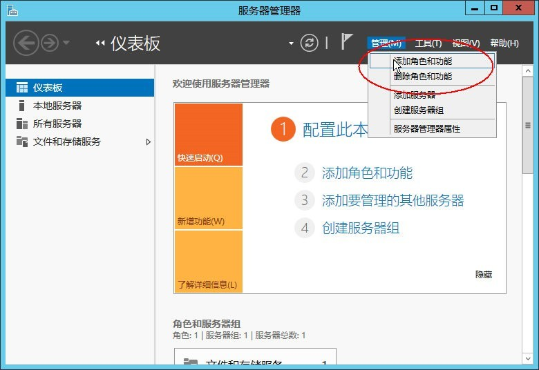
2. 进入 添加角色和功能向导，选择 “Web服务器(IIS)”。
	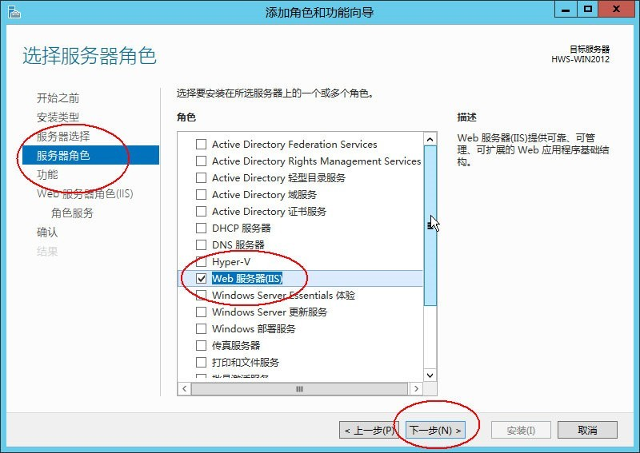
3. 根据情况选择对应功能，这里选择.Net3.5。
	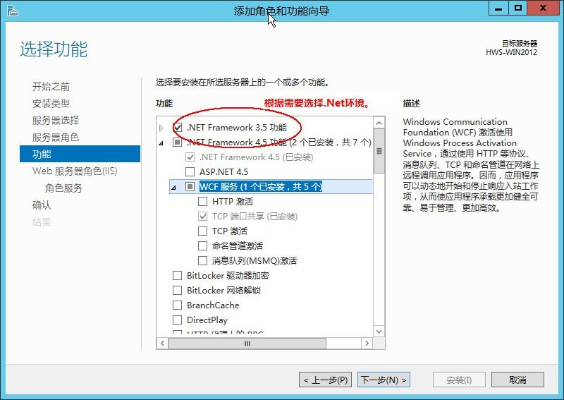
4. 安装角色服务，选择对应的安全性选项，如图。
	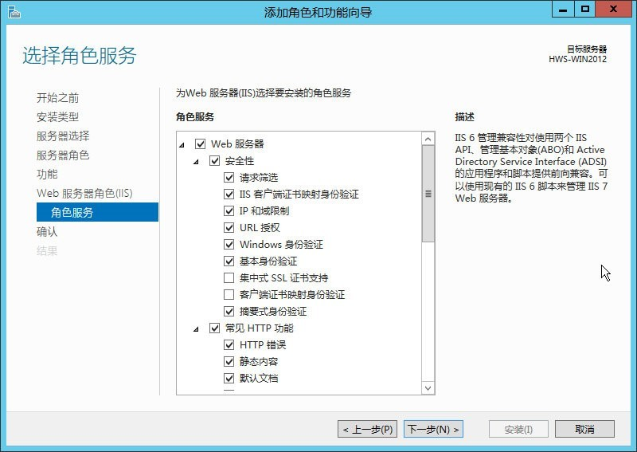
5. 选择“FTP服务器”，以及开设主机必须要用的“管理工具”，此项重要。
	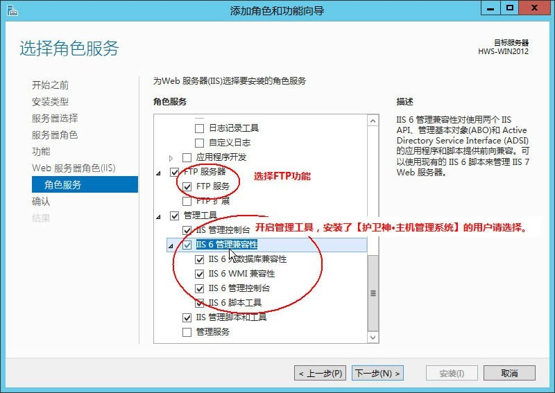
6. 等待安装，时间稍长，耐心等待即可。
	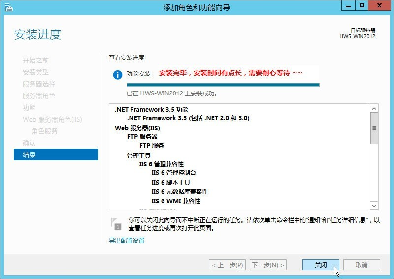
7. 安装完毕，打开IIS管理器查看。
	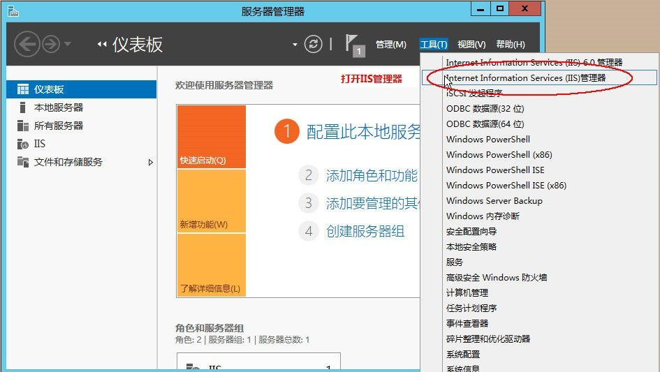
8. 打开了IIS管理器，看到程序池，站点，至此，在Windows2012下安装IIS已经成功。
	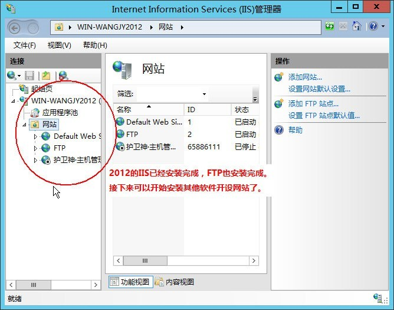
### 2. 安装FTP
1. 单击图标进入服务器管理器。
	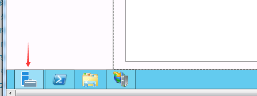
2. 单击 IIS， 右击服务器，选择 Internet 信息服务（IIS）管理器。
	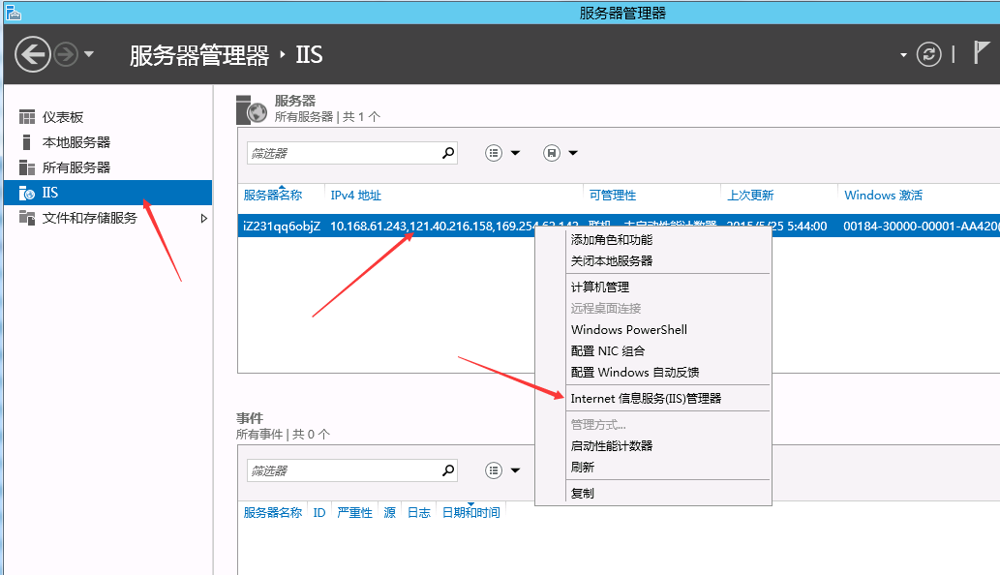
3. 右击服务器，选择添加 FTP 站点。
	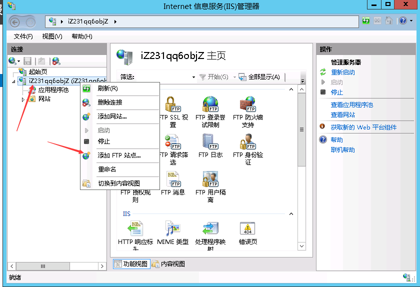
4. 填写 FTP 站点名称，选择 FTP 路径，单击下一步。
	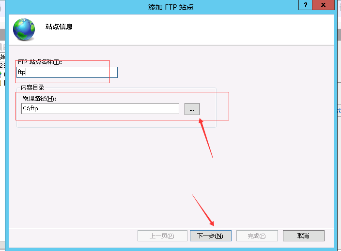
5. IP地址选择全部未分配，SSL选择无SSL。
	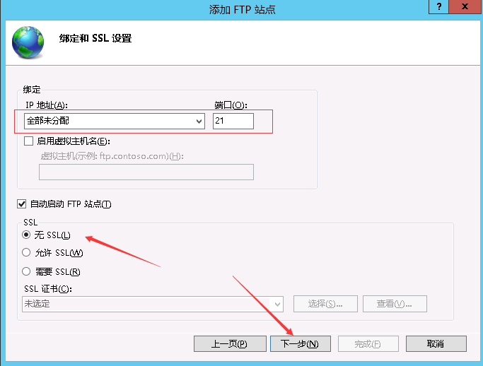
6. 身份验证选择基本，授权选择所有用户 ，权限设置为读取与写入 。单击完成。
	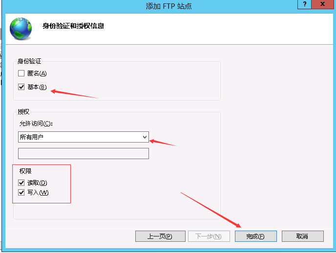
7. 使用系统默认的 administrator 账号和密码，进行登录测试，现在您可以可以正常上传下载文件。
	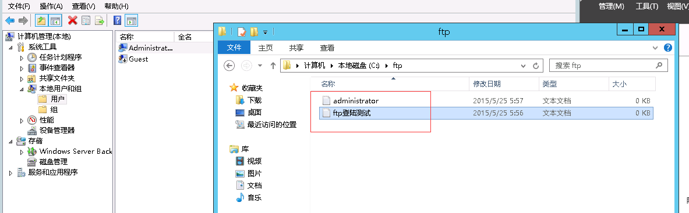
### 3. 阿里云安全设置开发ftp端口
	添加规则选择FTP
	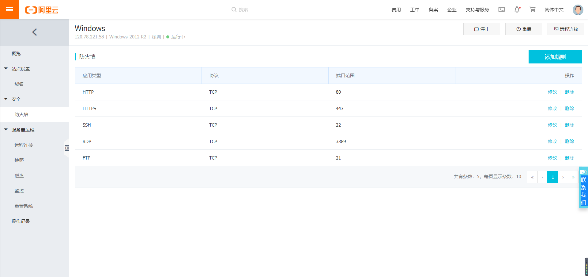
### 遇到的问题与解决办法
	1.Xftp 提示无法显示远程文件
	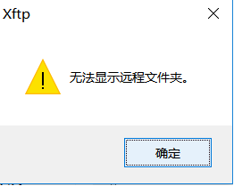
	点击属性->选项->将使用被动模式选项去掉即可
	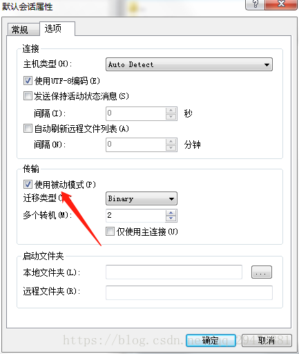
	\* 如果还不行请检查目录是否属于当前用户下的目录，用户是否有权限访问当前目录

## 摘自
[Windows2012安装IIS和FTP](https://help.aliyun.com/knowledge_detail/40896.html?spm=5176.10695662.1996646101.searchclickresult.582843c0LhJGp6) 
[云服务器 ECS Windows Server 通过 IIS 配置 FTP](https://help.aliyun.com/knowledge_detail/40944.html#windows2012) 
[Xftp 提示无法显示远程文件夹](https://blog.csdn.net/qq_29473881/article/details/82740592)