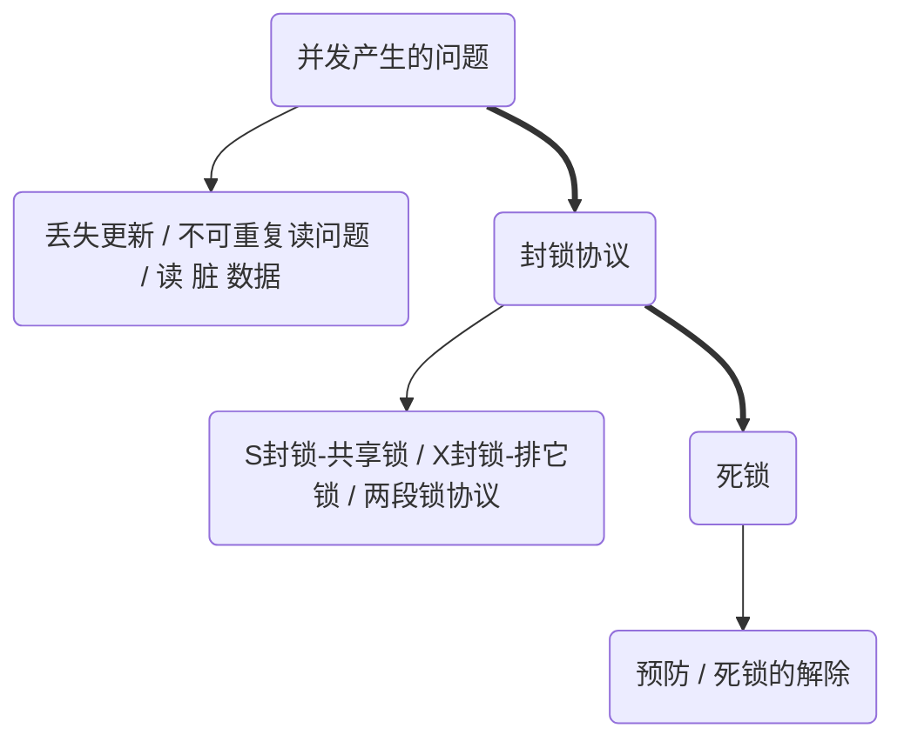

# 并发控制
## 事务
四个特性：
- 原子性
- 一致性
- 隔离性
- 持续性

## 并发产生的问题

```mermaid
graph TB
id1(并发产生的问题)-->id2(丢失更新 / 不可重复读问题 / 读 脏 数据)
id1(并发产生的问题)==>id3(封锁协议)
id3(封锁协议)-->id4(S封锁-共享锁 / X封锁-排它锁 / 两段锁协议)
id3(封锁协议)==>id5(死锁)
id5(死锁)-->id6(预防 / 死锁的解除)
```
# 数据库完整性约束
## 实体完整性约束
主键的完整性：
- 非空
- 唯一

## 参照完整性约束
外键的完整性：
要么空 否则 得有一个正确的索引

## 用户自定义完整性约束

## 触发器
脚本