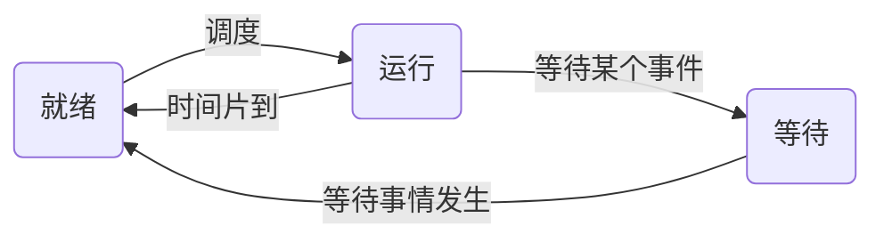
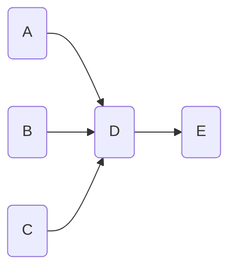

# 操作系统

## 进程管理

### 概念
- 进程是程序在一个数据集合上运行的过程，它是系统的一个独立单位。它由==程序块==、==进程控制块（PCB）==和==数据块==三部分组成。
- 进程与程序的区别：
    - 进程是程序的一次执行过程，没有程序就没有进程。
    - 程序是完成某个特定功能的一系列程序语句的集合，只要不被破坏，它就永远存在。
    - 程序是一个静态的概念，而进程是一个动态的概念，它由创建而产生，完成任务后因撤销而消亡。
    - 进程是系统进行资源分配和调度的独立单位，而程序不是。
### 进程的状态
==三态模型：==

### 进程的同步与互斥
- 直接制约关系
- 间接制约关系
- 临界资源

### PV操作
- 临界资源：诸进程间需要互斥方式对其进行共享的资源，如打印机、磁带机等
- 临界区：每个进程中访问临界资源的==那段代码==称为==临界区==
- 信号量：是一种==特殊的变量==(可正可负)
- ==P是荷兰语Passeren,  V是荷兰语的Verhoog。==

操作|S值（信号量）变化|说明
-----|-----|--------
P操作|S=S-1|申请资源
V操作|S=S+1|释放资源

#### 同步模型 

生产者|消费者
-|-
生产一个产品 P(s1)|P(s2) 从缓冲区取产品；
送产品到缓冲区 V(s2)|V(s1) 消费产品
PV操作是成对的

#### 前趋图（帮助理解）

例如上图：
Sa = Sb = Sc = Sd = 0; 
==线程D需要等待线程A、B、C的V(Sa、Sb、Sc)的唤醒 : P(Sa、Sb、Sc)==
### 死锁问题
如果==设计不当==或进程在==等待一件不可能发生的事==，进程就会==死锁==。
#### 求至少需要多少个资
给每个进程分配他们所需要的资源 - 1个再给系统留有一个
变量名|说明
-|-
k|每个进程需要的资源
n|进程数
$$
    (k-1)n + 1
$$
#### 死锁的避免
- 有序资源算法 （全部进程都给他们需要的）
- 银行家算法
    - 当一个进程对==资源的最大需求量==不超过==系统中的资源数==时可以接纳该进程。
    - 进程可以分期请求资源，但请求的总数不能超过 ==最大需求量==
    - 当系统现有的资源不能满足进程尚需资源数时，对进程的请求可以推迟分配，但总能使进程在 有限的时间里得到资源。

## 存储管理
### 页式存储组织
将程序与内存均划分为==同样大小的块==，以页为单位将程序调入内存。

$$
逻辑地址=页号+页内地址

物理地址=页帧号（物理块号）+页内地址
$$

优点：利用率高，碎片小，分配及管理简单。
缺点：增加了系统开销；可能产生抖动现象。

### 段式存储组织
*按用户作业中的自然段（程序段）来划分逻辑空间，然后调入内存，==段的长度可以不一样==。*

优点：多道程序共享内存，各段程序修改互不影响
缺点：内存利用率低，内存碎片浪费大

### 段页式存储组织
==段式和页式的综合体。== 
==先分段，再分页。== 
1个程序有若干个段，每个段中可以有若干页，每个页的大小相同，但每个段的大小不同。

优点：空间浪费小、存储共享容易、存储保护容易、能动态链接 
缺点：由于管理软件的增加，复杂性和开销也随之增加，需要的硬件以及占用的内容也有所增加，使得执行速度大大下降。
### 页面置换算法
- 最优算法（Optimal, OPT）
- 随机算法（RAND）
- 先进先出算法（FIFO）: 有可能产生“抖动”。例如, 43214543215序列，用4个页面比3个页面更差
- 最近最少使用算法(LRU)：不会“抖动”，LRU的理论依据是 ==“局部性原理”==。
    - 时间局部性：刚被访问的内容，立即又被访问。
    - 空间局部性：刚被访问的内容，临近的空间很快就访问。

### 磁盘管理
$$
存取时间 = 寻道时间 + 等待时间
$$
寻道时间：指磁头移动到磁道所需的时间。 
等待时间：等待读写的扇区转到磁头下方所用的时间。

### 磁盘调度算法
- 先到先服务（FCFS）
- 最短寻道时间优先（SSTF）
- 扫描算法（SCAN）：电梯算法
- 循环扫描（CSCAN）算法

### 读取磁盘数据时间计算
读取磁盘数据的时间应包括以下:
1. 找磁道的时间
2. 找块（扇区）的时间，即旋转延迟时间。
3. 传输时间。

## 作业管理
### 作业状态与作业管理 

### 作业调度算法
- 先来先服务法
- 时间片轮转法
- 短时间优先法
- 最高优先权优先法
- 高响应比优先法
$$
    响应比 = \frac{作业等待时间}{作业执行时间}
$$
## 文件管理
### 索引文件结构
- 直接索引：

- 一级间接索引：

- 二级间接索引：

*物理盘块存放的是逻辑页*
- 逻辑页计算公式
    - 直接索引时1个节点对应一个逻辑页
    - 间接索引时一个索引节点代表的逻辑页数为：
$$
n^x
$$
变量 | 说明
---|---
n | 一层间接索引的地址项数
x | 间接索引的层数

### 树形目录结构
- 相对路径
- 绝对路径

### 空间存储空间的管理
- 位视图

## 设备管理
### 数据传输控制方式
**以下按效率排名**
1. I/O处理器（IOP）
2. 通道方式
3. DMA方式：DMA方式是为了在==主存与外设之间==实现高速、批量数据交换而设置的。DMA方式比程序控制方式与中断方式都高效。
4. 程序中断方式：与程序控制方式相比，中断方式因为CPU无需等待而提高了传输请求的响应速度。
5. 程序控制（查询）方式：分为==无条件传送==和==程序查询==方式两种。方法简单，硬件开销小，但I/O能力不高，严重影响CPU的利用率。

### 虚设备与SPOOLING技术
SPOOLing是关于慢速字符设备如何与计算机交换信息的一种技术，通常称为“假脱机技术”。SPOOLing技术通过磁盘实现。 
*可简单想象为一个队列把任务排队按序执行*