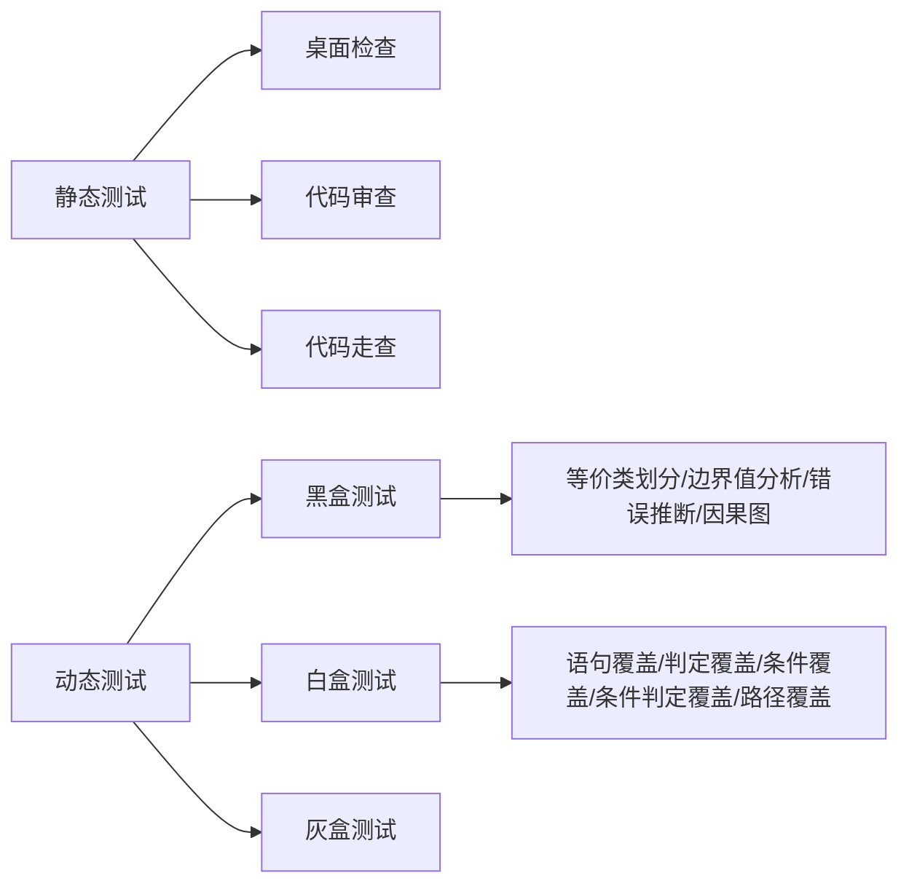
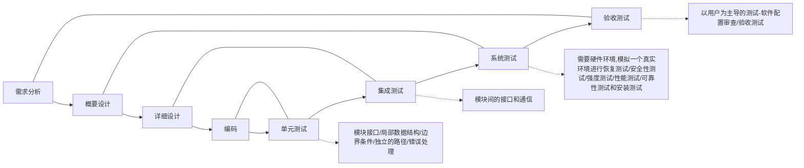
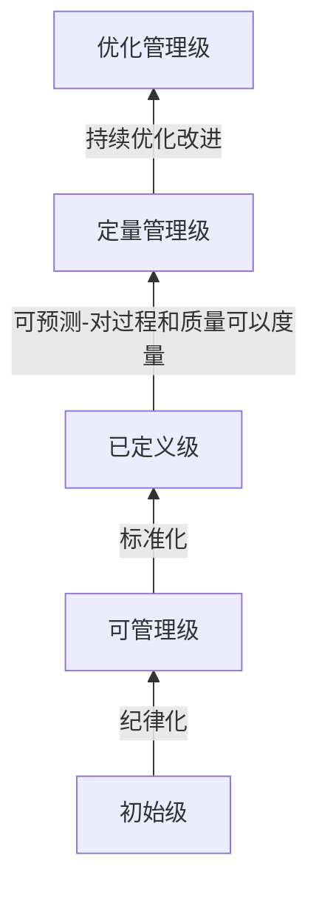

# 系统开发基础
## 软件开发模型
- 瀑布模型
    
    用于需求明确的时候

    <html>
    <table>
    <th>阶段</th><th>具体活动</th><th>产物</th>
    <tr><td rowspan=2>定义阶段</td><td>软件计划</td><td>1. 可行性分析 2. 软件计划书</td></tr>
    <tr><td>需求分析</td><td> 需求规格说明书</td></tr>
    <tr><td rowspan=3>开发阶段</td><td>软件设计</td><td>1. 概要设计说明书 2. 详细设计说明书</td></tr>
    <tr><td>程序编码</td><td>系统</td></tr>
    <tr><td>软件测试</td><td>测试报告 (测试计划、测试用意)</td></tr>
    <tr><td>维护阶段</td><td>运行维护</td><td>交付给用户，跟踪维护。</td></tr>
    </table>
    </html>

    - V模型
        - 相对瀑布模型更重视测试
- 喷泉模型 
    *面向对象的开发模型* 
    没有明确的界限

- 演化模型
    - 原型模型 
        沟通后快速构建原型并交付，收集反馈并在下一轮进行改进。
        - 探索型原型
        - 实验型原型
        - 演化型原型：在原型进行后续的开发
    - 螺旋模型 
        - 综合了瀑布模型与原型模型
        - 给每个螺旋周期分成了四个步骤：制定计划、==风险分析==、实施工程、用户评估
        - 强调风险分析，使用户、开发人员对演化层出现的风险有所了解，从而做出反应。螺旋模型适合开发庞大、复杂、高风险的系统。
- 统一过程（UP/RUP）
    - “用例驱动，以架构为中心迭代，并增量”
    - 分成四个阶段：
        1. 初始（起始）
        2. 细化（精化）
        3. 构建
        4. 移交（交付）
- 敏捷方法
    - 自适应开发(ASD)
    - 并列争球法(SCRUM)
        - 明确定义了的可重复的方法过程
    - 水晶方法(Crystal)
        - 用最少的纪律约束而仍能成功的方法 
    - 特性驱动开发(FDD)
        - 开发人员分两类：富有经验的作为协调者、设计者和指导者，另一类则主要做源码编写。 
    - 极限编程(XP)
        - 费用严格控制的公司中使用

## 软件开发方法
- 结构化方法(面向数据流)
    - 用户至上
    - 严格区分工作阶段，每阶段有任务和结果
    - 强调系统开发过程的整体性和全局性
    - 系统开发过程工程化，文档资料标准化
    - ==自顶向下，逐步分解（求精）==
    - 不适合复杂、大型的项目
- 原型法
- 面向对象方法
    - 更好的==复用性==
    - 关键在于建立一个全面、合理、统一的模型
    - 分析、设计、实现三个阶段，==界限不明确==(喷泉模型)
- 面向服务的方法 （SOA）
- 面向数据结构的方法 (Jackson)

## 需求分析
- 需求的任务
- 需求的过程
    - 问题识别
    - 分析与综合
    - 编制需求分析文档
    - 需求分析与评审
- 需求的分类
    - 功能需求
    - 非功能需求
    - 设计约束 
- 应用的工具
    - 数据流图(DFD)
    - 数据字典(DD)
    - 判定表
    - 判定树（决策树）

## 软件设计
- 软件设计的任务与活动
- 模块设计原则
    - 保证独立性（==高内聚，低耦合==）
- 应用的工具
    - IPO图
    - PDL（程序描述语言）:用来描述IPO图
    - PAD（问题分析图）
    - 程序流程图
    - N/S盒图

*下面由内聚程度高到低排列*
内聚类型|描述
---|---
功能内聚|完成==一个单一功能==，各个部分协同工作，缺一不可。
顺序内聚|处理元素相关，而且必须==顺序执行==
通信内聚|所有处理元素==集中在一个数据结构的区域==上
过程内聚|处理元素相关，而且必须按==特定的次序执行==
瞬时内聚（时间内聚）|所包含的任务必须在==同一时间间隔==内执行
逻辑内聚|完成==逻辑上相关==的一组任务
偶然内聚（巧合内聚）|完成一组==没有关系或松散关系==的任务
*下面由耦合程度低到高排列*
耦合类型|描述
---|---
非直接耦合|两个模块之间没有直接关系，他们之间的联系完全是通过==主模块的控制和调用==来实现的
数据耦合|一组模块借助参数表==传递简单数据==
标记耦合|一组模块通过参数表==传递记录信息==（数据结构）
控制耦合|模块之间传递的信息中包含用于==控制模块内部逻辑==的信息
外部耦合|一组模块都访问同一全局简单变量，而且不是通过参数表传递该全局变量的信息
公共耦合|多个模块都访问同一个公共数据环境
内容耦合|一个模块直接访问另一个模块的内部数据；一个模块不通过正常入口转到另一个模块的内部；两个模块有一部分程序代码重叠；一个模块有多个入口

## 软件测试

- 等价类划分
    - 确定无效与有效等价类
    - 设计用例尽可能多的覆盖有效类
    - 设计用例只覆盖一个无效类
- 边界值分析
    - 处理边界情况时最容易出错
    - 选区的测试数据应该恰好等于、稍小于或稍大于边界值

- 回归测试：测试出bug在提第二次提交的时候再测一遍。
- 性能测试
    - 负载测试：在一定的资源的条件下能够承受的负载（最大负荷量）是多少。
    - 压力测试：达到失效压力下能够承受的最大压力。

### McCabe复杂度（环路复杂度）
$$
    V(G)=m-n+2
$$
符号|说明
---|---
m|边数
n|节点数

$$
    V(G)=封闭区域数+1
$$
## 软件维护
- 可维护性因素决定
    - 可理解性
        - 文档 
    - 可测试性
    - 可修改性 (可扩展性)
- 软件维护类型
    - 改正性维护：==发布前==的bug没改，发布后才改。
    - 适应性维护：因为==外部环境==发生了变化的更改。
    - 预防性维护：为了==未来（将来）==的某个时候而做的修改。
    - 完善性维护(占维护的50%)：为了==扩充功能和改善性能==而进行的更改。

## 软件工程
### 国家标准-软件文档管理指南-按阅读对象分类
- **开发文档**
    - 可行性研究和项目书
    - 需求规格说明
    - 功能规格说明 
    - 设计规格说明（包括程序和书序规格说明）
    - 开发计划
    - 软件集成和测试计划
    - 质量保证计划、标准、进度
    - 安全和测试信息
- 产品文档（跟用户有关的）
    - 培训手册
    - 参考手册和用户指南
    - 软件支持手册
    - 产品手册和信息广告
- 管理文档

### 软件质量保证
外部和内部质量：
- 功能性
- 可靠性
- 易用性
- 效率
- 维护性
- 可移植性

### 软件过程改进-CMMI
CMMI（软件成熟度模型）：衡量一个企业达到了一个什么资质。

## 项目管理
十大知识领域：
1. 范围管理
2. ==时间管理==
3. 成本管理
4. 质量管理
5. 人力资源管理
6. 沟通管理
7. 风险管理
8. 采购管理
9. 整体管理
10. 项目干系人管理

### 时间管理
#### 前导图法（单代号网络图，PDM）
求关键路径 = 求工期最长路径 
关键活动：关键路径上的活动，==总时差为0。==

## 活动排序
### 箭头突发（双代号网络图，ADM）
虚线：表示两者有关系（不耗时）

## 项目管理
风险曝光度（Risk Exposure）:风险==出现的概率乘以==风险==可能造成的损失==。