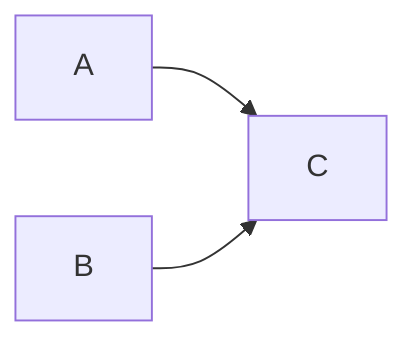
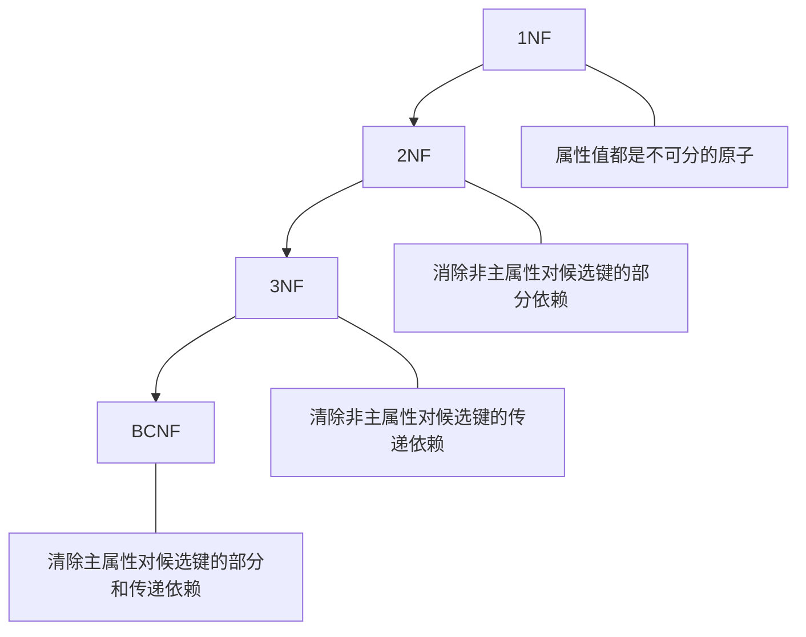

# 规范化理论
- **数据冗余**
- 修改异常
- 插入异常
- 删除异常

## 函数依赖
- 部分依赖 
依赖集1：{AB -> C, A -> C}

- 传递依赖 
依赖集2：{A -> B, B -> C}

## 键
- 候选键 
    唯一标识元组，且无冗余 
- 主键 
    任选一个候选键为主键。
- 外键 
    其他关系的主键

### 求候选键
- 图示法求候选键
    1. 将关系的函数依赖关系，用“有向图”的方式表示。
    2. 找出入度为0的属性，并以该属性集合为起点，尝试遍历有向图，**若能正常遍历图中所有结点**，则该==属性集==即为关系模式的==候选键==。
    3. 若入度为0的属性集**不能遍历图中所有结点**，则需要尝试性的将一些==中间结点==（*既有入度，也有出度的结点*）并入入度为0的属性集，==直到该集合你能遍历所有结点，集合为候选键。==

## 主属性与非主属性
**组成候选码的属性就是主属性，其它的就是非主属性。**

## 范式
- 第一范式（1NF） 
当且仅当所有域只包含==原子值==，==即每个属性都是不可再分的数据项==，则称该关系模式是第一范式。
- 第二范式（2NF） 
当且仅当关系模式是第一范式（1NF），且每一个==非主属性完全依赖候选键（没不完全依赖时）==,则称该关系模式是第二范式。
- 第三范式（3NF） 
当且仅当关系模式是第二范式（2NF），且该关系模型中没有==非主属性传递依赖于候选键==时，则称关系模式是第三范式。
- BC范式（BCNF） 
当且仅当依赖集中每个依赖的决定因素必定包含该关系模式的某个候选码。

1NF ⊃ 2NF ⊃ 3NF ⊃ BCNF

## 模式分解
### 保持函数依赖分解
数据库模式 ρ={R1,R2,...,Rk} 是关系模式 R 的一个分解，F是R上的函数依赖集，ρ中每个模式Ri上的FD集是Fi。 
如果{F1,F2,...,Fk}与F是等价的（即相互逻辑蕴含），那么称为分解ρ保持FD。 
*也就是说一个 关系模式 分成 多个关系模式的组合 表达的关系没有改变*
### 无损分解
有损：不能还原。 
无损：可以还原。 
无损联结分解：指将一个关系模式分解成若干个关系模式后，通过自然联接和投影等运算仍能还原到原来的关系模式。
### 表格法
### 公式法
适应于两个点的时候