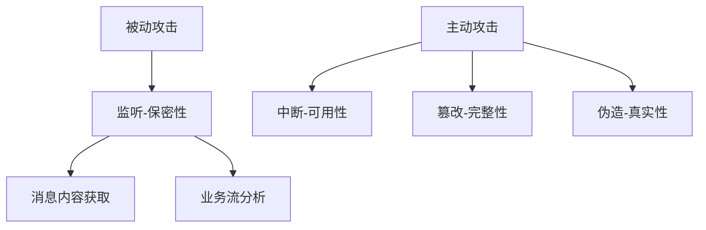
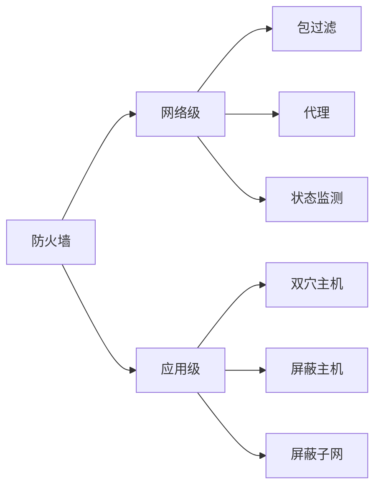

# 计算机网络与信息安全
## 计算机网络
### OSI/RM七层模型
<html>
<table>
<th>层次</th><th>名称</th><th>主要功能</th><th>主要设备及协议</th>
<tr>
<td>7</td><td>应用层</td><td>实现具体的应用功能</td><td rowspan=3>POP3、FTP、HTTP、Telnet、SMTP DHCP、TFTP、SNMP、DNS</td></tr>
<tr><td>6</td><td>表示层</td><td>数据格式与表达、加密、压缩</td></tr>
<tr><td>5</td><td>会话层</td><td>建立、管理和终止会话</td></tr>
<tr><td>4</td><td>传输层</td><td>端到端的连接</td><td>TCP、UDP</td></tr>
<tr><td>3</td><td>网络层</td><td>分组传输和路由选择</td><td>三层交换机、路由器 ARP、RARP、IP、ICMP、IGMP</td></tr>
<tr><td>2</td><td>数据链路层</td><td>传送以帧为单位的信息</td><td>网桥、交换机（多端网桥）、网卡 PPTP、L2TP、SLIP、PPP</td></tr>
<tr><td>1</td><td>物理层</td><td>二进制传输</td><td>中继器、集线器（多端中继器）</td></tr>
</table>
</html>

- 传输层
    
    协议|特点
    ---|---
    TCP（传输控制协议）| - 面向连接的服务 - 可靠的
    UDP（用户数据报协议）|- 无连接的服务   - 不可靠
- 网络层
    - 三层交换机：具有路由功能。
    - 路由器：具有路由功能、可以解决交换机的广播问题。
    
    协议|说明
    ---|---
    ARP（地址解析协议）| 把IP地址转换为MAC地址
    RARP（反向地址解析协议）| 把MAC地址转换为IP地址
    IP（网际协议） | 分配用户上网使用的数字标签
    ICMP（因特网控制协议） | 1.它是TCP/IP协议簇的一个子协议。 2.用于在IP主机、路由器之间传递控制消息。 3.控制消息是指网络通不通、主机是否可达、路由是否可用等网络本身的消息。
    IGMP（因特网组管理协议） | 组播协议（网关信息协议）
- 数据链路层
    - 网桥：可以隔离冲突、但会出现广播风暴。
- 物理层
    - 中继器：延长数据传输距离
    - 集线器(Hub）: 可以分流、但会出现冲突域

### TCP/IP协议族
TCP/IP模型与OSI七层模型的对应：
<html>
<table>
<th>TCP/IP</th><th>OSI</th>
<tr><td rowspan=3>应用层</td><td>应用层</td></tr>
<tr><td>表示层</td></tr>
<tr><td>会话层</td></tr>
<tr><td>传输层</td><td>传输层</td></tr>
<tr><td>网际层</td><td>网际层</td></tr>
<tr><td rowspan=2>网络接口层</td><td>数据链路层</td></tr>
<tr><td>物理层</td></tr>
</table>
</html>

*下列分层为TCP/IP分层*
- 应用层
    - 基于TCP协议
        协议|端口|功能/说明
        ---|---|---
        POP3（离线收邮件） | 110 | 邮件收取
        FTP  | 20(主动)/21(控制)  (被动则两者随机) | 文件传输
        HTTP | 80 | 超文本传输协议（访问网站）
        HTTPS | 443 | 带加密的超文本传输协议
        Telnet| 23 | 远程访问
        SMTP（简单邮件传输协议）| 25 | 邮件发送 
    - 基于UDP协议
        协议|端口|功能/说明
        ---|---|---
        DHCP| 67 | 自动分配IP地址
        TFTP| 69 | 文件传输协议
        SNMP| 161 | 简单 网路管理协议
        DNS | 53 | 域名解析服务
    - NFS：
- 传输层
    - TCP
    - UDP
- 网际层  
    IP、ICMP、IGMP、ARP、RARP
- 网络接口层  
    CSMA/CD: 载波监听多路访问

### IP地址
*目前使用的是IPv4每个地址都是32位*
网络类型 | 网络号与主机号的分布 | 网络号范围
---|---|---
A类|8位网络号 + 24位主机号 | 0-127（二进制为0开头）
B类|16位网络号 + 16位主机号|128-191（二进制为10开头）
C类|24位网络号 + 8位主机号|192-223（二进制为110开头）
*D、E类省略*
- 子网掩码划分子网
    - 原来的网络号部分全为1（255）
    - 主机号的前面划分出作为子网网络号的部分。 例如:划分27个子网，主机号前面5（25=32>27）位就为 11111（248）

### 网络规划与设计
四个过程：
1. 需求分析
    - 网络功能要求
    - 网络性能要求
    - 网络运行环境的要求
    - 网络的可扩充性和可维护性的要求
2. 网络规划原则
    - 实用性原则
    - 开放性原则
    - 先进性原则
3. 网络设计与实施原则
    - 可靠性原则
    - 安全性原则
    - 高效性原则
    - 可扩展性原则
4. 层次化网络设计
    - 核心层（快速、高效的数据分发）
    - 汇入层（主要以过滤为主）
    - 接入层（接入PC端）

### 网络分类
- 按分布范围分
    - 局域网(LAN)
    - 城域网(MAN)
    - 广域网(WAN)
    - 因特网
- 按拓扑结构分
    - 总线型
    - 星型
    - 环形

### 网络接入技术
- 有限接入
    - 公用交换电话网络(PSTN)
    - 数字数据网(DDN)
    - 综合业务数字网(ISDN)
    - **非对称数字用户线路（ADSL）**
    - 同轴光纤技术(HFC)
- 无限接入
    -  IEEE 802.11(WIFI)
    -  IEEE 802.15(蓝牙Bluetooth)
    -  红外(lrDA)
    -  WAPI
- 3G标准
    -  WCDMA
    -  CDMA2000
    -  TD-SCDMA
    -  WirelessMAN(802.16)(WiMAX)
- 4G标准
    -  FDD-LTE
    -  TD-LTE
    -  WirelessMAN(802.16m)(WiMAX)

## 信息安全
### 对称加密技术
使用同一套密钥

对称加密：Ke=Kd 
特点：
1. 加密强度不高，但效率高;
2. 密钥分发困难。

==常见对称密钥算法：DES、3DES(三重DES)、RC-5、IDEA.==

### 非对称加密技术
- 每人都有一成对的密钥（公钥和私钥） 
- 发给谁就用谁的公钥加密，接收时用自己的私钥解密。

非对称加密：：Ke≠Kd 密钥必须成对使用（公钥加密，私钥解密） 
特点： 加密速度慢，但强度高。
常见非对称密钥加密算法：RSA、ECC.

### 数字签名
- 每人都有一成对的密钥（公钥和私钥） 
- 用发送方的私钥加密，接收时用发送方的公钥解密。

### 信息摘要
*一般用于判断两者是否相同

数字摘要：由单向散列函数加密成固定长度的散列值。（不可逆） 

常用算法有MD5, SHA等。 
市场上广泛使用的MD5、SHA的散列值分别为128位和160位，由于SHA通常采用的密钥长度较长，因此安全性高于MD5

### PKI公钥体系
CA中心：
- 管理密钥
    - 注册密钥
    - 更新密钥
    - 注销密钥
- 分发证书给服务器（数字签名）

## 网络安全
### 各个网络层次的安全保障
- 物理层
    - 隔离
    - 屏蔽
- 数据链路层
    - 链路加密
    - PPTP
    - L2TP
- 网络层
    - 防火墙
    - IPSec
- 传输层
    - TLS （基于SSL3.0）
    - SET
    - SSL
- 会话层
    - SSL
- 表示层
    - SSL
- 应用层
    - PGP
    - HTTPS
    - SSL 
注意：SSL属于传输层、会话层、表示层、应用层四层

### 主动攻击与被动攻击

### 防火墙
特点：防外不防内

防火墙类型 | 说明
---|---
包过滤 | 只检查数据包的格式（原地址、目标地址...是否合理），速度比较快，但安全性差。
代理 | 不仅检查包，还检查里面。速度慢，但安全性好。
状态监测 | 使用状态表。综合速度与安全性。
双穴主机 | 将内部网络与外部网络用一台主机分隔开
屏蔽主机 | 在双穴主机的基础上，用路屏蔽路由器将堡垒主机与外网隔开
屏蔽子网 | 两个屏蔽路由器隔开内网与外网 两个屏蔽路由器之间为BMZ(非军事区) **BMZ区可被外网访问也可被内网访问**（web服务器放在此）

## 安全防范体系
- 物理环境的安全性。
- 操作系统安全性。
- 网络安全性。
- 应用的安全性。
- 管理的安全性。

## 病毒与木马
- 病毒：编制或在计算机程序中插入的==破坏==计算机功能或者数据，以你影响计算机使用并且能够自我复制的一组计算机指令或者程序代码。
- 木马：计算机木马是一种后门程序，常被黑客用作控制远程计算机的工具。